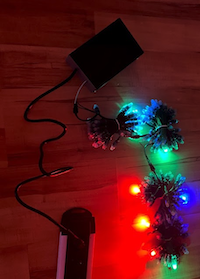
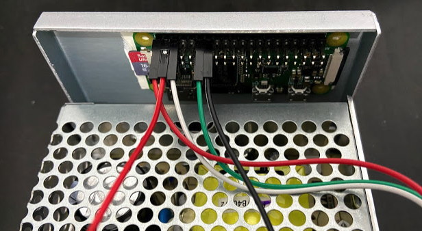

# LED System Build Instructions
The LEDs used are **addressable LED** stripes. 
There are many type of them (i.e. ws281x, ws2801, apa102). 
The original project goes for WS2801, but they were not available in Q4 2020 for me. 
Therefore this project uses WS2811 LEDs. 

## General Considerations
Bear in mind that 198 LEDs wired with 3-4 cables each mean a lot of soldering work. You probably want to order ready-to-use LED stripes with a 
suitable custom length. 5V leads to higher currents compared to 12V versions of comparable bright LEDs. The voltage drop in such a length will lead
to color mismatches. To fix this the stripes usually have separate voltage connectors on each end in addition to the 3 / 4 pin connection. 

In my case it was not possible to order custom length as of Q4 2020. So I ended up using 3x 4x 50 LED strips and use every 3rd LED. 
The 
patches to the LED layouts are in :latest.
- FIXME.
- TBD: configure and test LED_LAYOUT
- TBD: method for initial test
- TBD: method for mounting holds

## Wiring the LED stripes
The WS2811 LED strips have three wires (colors may differ in your case): 
- White = GND
- Red = 5V
- Green = Signal 
- Both the LED and the RASPI are driven by the same power supply (warning: GPIO power on raspi has no fuse)

## Configure the LED addresses FIXME!
- Create a custom layout in <TBD> FIXME moonboard.py
sudo /usr/bin/python3  /home/pi/moonboard/run.py --led_layout=gz --debug --driver PiWS281x

- TBD: run in led python3 moonboard.py ... 

## Further readings:
- [Raspberry Pi Zero als LED Strip Controller](https://developer-blog.net/raspberry-pi-zero-als-led-strip-controller)
